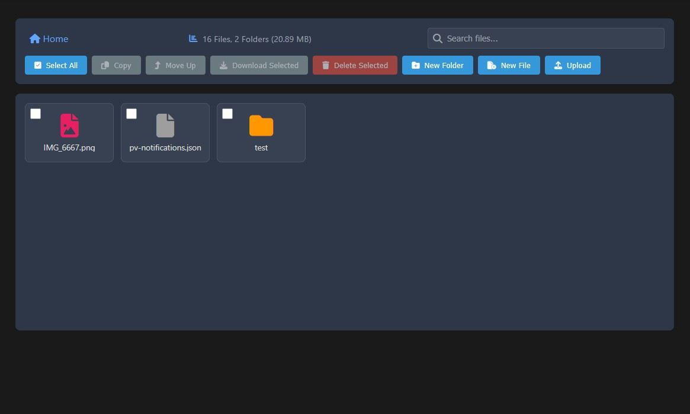

# Dateimanager für Synology NAS

**Version:** v1.0.0

Webanwendung zur Dateiverwaltung auf Synology NAS über Web Station.

## 🚀 Hauptfunktionen

### Dateiverwaltung
- ✅ Erstellen, Löschen und Umbenennen von Dateien und Ordnern
- ✅ Kopieren von Dateien und Ordnern mit automatischer Umbenennung bei Konflikten
- ✅ Mehrfachauswahl über Checkboxen
- ✅ Datei-Upload (Drag & Drop und über Button)
- ✅ Download einzelner Dateien oder mehrerer als ZIP-Archiv
- ✅ Upload-Fortschrittsbalken mit Prozentanzeige und Dateinamen

### Dateien verschieben (Drag & Drop)
- ✅ Ziehen auf Ordner in der Liste
- ✅ Ziehen auf Navigationselement (Breadcrumb)
- ✅ Ziehen auf leeren Bereich zum Verschieben in übergeordneten Ordner
- ✅ "Nach oben verschieben"-Button für mobile Geräte
- ✅ Visuelle Hervorhebung der Zielelemente

### Suche und Filterung
- ✅ Echtzeit-Suche nach Dateinamen
- ✅ Hervorhebung gefundener Dateien
- ✅ Ausblenden nicht gefundener Elemente
- ✅ Suche löschen per Button oder ESC-Taste

### Informationen und Statistiken
- ✅ Detaillierte Dateiinformationen: Größe, Datum, Berechtigungen, MIME-Typ
- ✅ Für Bilder: Auflösung und EXIF-Daten (Kamera, ISO, Belichtung)
- ✅ Statistik ausgewählter Dateien: Anzahl und Gesamtgröße
- ✅ Ordnerstatistik: Rekursive Zählung von Dateien, Ordnern und Größe

### Visualisierung
- ✅ Zwei Anzeigemodi: Raster und Liste
- ✅ Miniaturansichten für Bilder (benötigt PHP GD)
- ✅ Dunkles Theme mit Speicherung der Auswahl
- ✅ Responsives Design für mobile Geräte
- ✅ Font Awesome Icons für verschiedene Dateitypen

### Mehrsprachigkeit
- ✅ Deutsch (DE)
- ✅ Englisch (EN)
- ✅ Russisch (RU)
- ✅ Speicherung der gewählten Sprache

## 🔒 Sicherheit

- Arbeitet nur innerhalb des `/upload`-Ordners
- Schutz vor Directory Traversal-Angriffen
- Überprüfung aller Pfade über `realpath()`
- Zugriff außerhalb von BASE_PATH verboten

## 💻 Technische Anforderungen

- Synology NAS mit Web Station
- Apache + PHP
- PHP-Erweiterung GD (optional, für Miniaturansichten)
- PHP-Erweiterung ZipArchive (für Download mehrerer Dateien)

## 📱 Responsive Design

- Desktop: Vollständige Oberfläche mit Text auf Buttons
- Tablet/Smartphone: Kompakte Oberfläche mit Icons
- Toolbar in 3 Zeilen: Breadcrumb, Statistik/Suche, Buttons
- Optimierung für Touchscreens

## 🎨 Benutzeroberfläche

- Modernes, klares Design
- Flüssige Animationen und Übergänge
- Visuelles Feedback für alle Aktionen
- Tooltips für alle Buttons
- Statistik-Panel unter der Navigation
